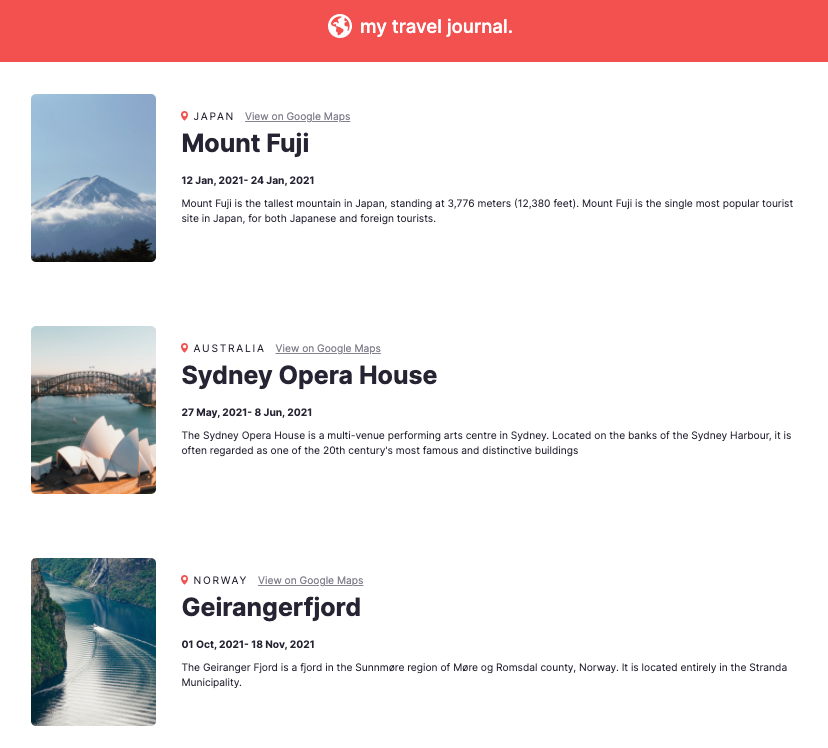

# My travel journal

## Table of contents

- [Overview](#overview)
  - [Screenshot](#screenshot)
  - [Links](#links)
- [My process](#my-process)
  - [Built with](#built-with)
- [Author](#author)

## Overview
A simple ReactJS app using a local hard-coded data file deployed with netlify.

### Screenshot

### Links

- Live Site URL: [my travel journal](https://lively-ganache-a6ff36.netlify.app/)

## My process

This was a very simple front end project built with create-react-app used as a react refresher for me. This was a solo project challenge from scrimba.
### Built with

- Semantic HTML5 markup
- CSS custom properties
- Flexbox
- CSS Grid
- Mobile-first workflow
- [React](https://reactjs.org/) - JS library

## Author

- Twitter - [@laynerzzzz](https://twitter.com/laynerzzzz)
- LinkedIn - [Layne Taylor] (https://www.linkedin.com/in/layne-taylor/)

